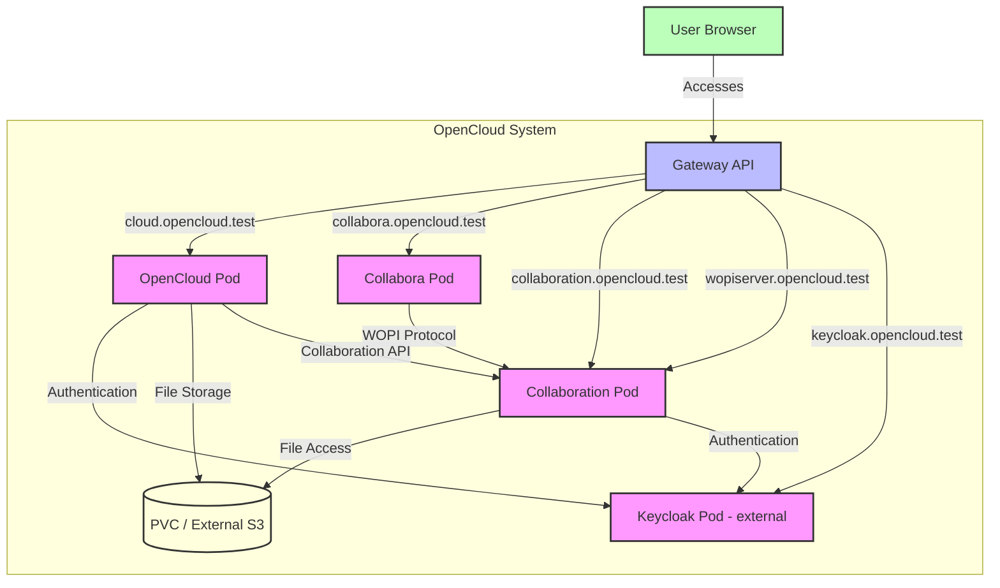

# OpenCloud Helm Charts

Welcome to the **OpenCloud Helm Charts** repository! This repository is intended as a community-driven space for developing and maintaining Helm charts for deploying OpenCloud on Kubernetes.

## 📑 Table of Contents

- [About](#-about)
- [Community](#-community)
- [Contributing](#-contributing)
- [Prerequisites](#prerequisites)
- [Installing the Helm Charts](#-installing-the-helm-charts)
- [Architecture](#architecture)
  - [Component Interaction Diagram](#component-interaction-diagram)
- [Configuration](#configuration)
  - [Global Settings](#global-settings)
  - [Image Settings](#image-settings)
  - [OpenCloud Settings](#opencloud-settings)
  - [OIDC Settings](#oidc-settings)
  - [Collabora Settings](#collabora-settings)
  - [Collaboration Service Settings](#collaboration-service-settings)
  - [Web Extensions Settings](#web-extensions-settings)
- [Gateway API Configuration](#gateway-api-configuration)
  - [HTTPRoute Settings](#httproute-settings)
- [Setting Up Gateway API with Talos, Cilium, and cert-manager](#setting-up-gateway-api-with-talos-cilium-and-cert-manager)
- [License](#-license)
- [Community Maintained](#community-maintained)

## 🚀 About

This repository is created to **welcome contributions from the community**. It does not contain official charts from OpenCloud GmbH and is **not officially supported by OpenCloud GmbH**. Instead, these charts are maintained by the open-source community.

OpenCloud is a cloud collaboration platform that provides file sync and share, document collaboration, and more. This Helm chart deploys OpenCloud with the **integrated identity manager (IDM)** by default — no external Keycloak, PostgreSQL, or MinIO required. Collabora (document editing) is bundled. Optionally, external OIDC (Keycloak, Auth0, etc.), external S3 storage, and ClamAV virus scanning can be configured.

## 💬 Community

Join our Matrix chat for discussions about OpenCloud Helm Charts:
- [OpenCloud Helm on Matrix](https://matrix.to/#/%23opencloud-helm:matrix.org)

For general OpenCloud discussions:
- [OpenCloud on Matrix](https://matrix.to/#/%23opencloud:matrix.org)
- [OpenCloud on Mastodon](https://social.opencloud.eu/@OpenCloud)
- [GitHub Discussions](https://github.com/orgs/opencloud-eu/discussions)

## 💡 Contributing

We encourage contributions from the community! If you'd like to contribute:
- Fork this repository
- Submit a Pull Request
- Discuss and collaborate on issues

Please ensure that your PR follows best practices and includes necessary documentation.

## Prerequisites

- Kubernetes 1.33+
- Helm 3.18.0+
- PV provisioner support in the underlying infrastructure (if persistence is enabled)
- Gateway API compatible ingress controller (e.g., Cilium Gateway) for HTTPS routing

## 📦 Installation

### Quick Start (Helm)

Deploy OpenCloud with the integrated IDM (no external Keycloak, PostgreSQL, or MinIO) in a single `helm install`. Works out of the box with a Gateway API-compatible ingress controller (e.g., Cilium Gateway).

```bash
# Navigate to the chart directory first
cd /path/to/helm-repo/charts/opencloud

# Then run the installation command
helm install opencloud . \
  --namespace opencloud \
  --create-namespace \
  --set httpRoute.enabled=true \
  --set httpRoute.gateway.name=cilium-gateway \
  --set httpRoute.gateway.namespace=kube-system \
  --set httpRoute.gateway.sectionName=opencloud
```

Verify the deployment:

```bash
kubectl get pods -n opencloud
```

Uninstall (PVCs are retained by Helm to preserve data — delete them manually if you want a clean slate):

```bash
helm uninstall opencloud -n opencloud
# Optional: drop retained PVCs
kubectl -n opencloud delete pvc -l app.kubernetes.io/instance=opencloud
```

> **Note:** Never delete the namespace — only use `helm uninstall`. This ensures PVCs always stay.

### Full Stack with FluxCD

For deploying the full stack with external Keycloak (OIDC), OpenLDAP (user management), and ClamAV (virus scanning), self-contained FluxCD HelmReleases live in `deployments/flux/`. No Helmfile or Timoni bundle required — each manifest is self-contained (inline database config, realm import, HTTPRoutes, HTTP→HTTPS redirects).

```bash
# One command: -R recurses into all subdirectories (keycloak/, openldap/,
# clamav/, opencloud/) and applies every .yaml in one shot.
kubectl apply -R -f charts/opencloud/deployments/flux/
```

Each `HelmRelease` is reconciled by the FluxCD `helm-controller`.

Reconcile after a change (edit a value, bump the chart, etc.):

```bash
for hr in $(kubectl get hr -A -o jsonpath='{range .items[*]}{.metadata.namespace}/{.metadata.name}{" "}{end}'); do flux reconcile helmrelease "$(echo $hr | cut -d/ -f2)" -n "$(echo $hr | cut -d/ -f1)"; done
```

Remove the full stack (deletes the HelmReleases; Flux's helm-controller then runs `helm uninstall` for each, dropping the chart-rendered Deployments / Services / ConfigMaps / HTTPRoutes / Secrets. **PVCs are retained by Helm** to preserve data — delete them manually if you want a clean slate):

```bash
kubectl delete -R -f charts/opencloud/deployments/flux/
# Optional: drop retained PVCs
kubectl -n opencloud delete pvc -l app.kubernetes.io/instance=opencloud
kubectl -n keycloak  delete pvc -l app.kubernetes.io/instance=keycloak-postgresql
kubectl -n openldap  delete pvc -l app.kubernetes.io/instance=openldap
```

> **Note:** Never delete the namespace — only flux-delete the HelmReleases or `helm uninstall`. This ensures PVCs always stay.

### Choosing a storage backend

The chart defaults to **`decomposed`** (PVC-backed metadata + blobs, no external S3). To switch, edit `charts/opencloud/deployments/flux/opencloud/opencloud.yaml` (Flux) or `values.yaml` (Helm):

| Backend | What to change | Effect |
|---------|---------------|--------|
| **Decomposed (default)** | nothing — `storage.mode: decomposed` | PVC stores metadata + blobs; no S3; `Recreate` rollout strategy (single RWO volume) |
| **Decomposed + RWX** | under `storage.decomposed.persistence`, set `accessMode: ReadWriteMany` | Supports RollingUpdate + multiple replicas (requires CephFS / NFS / shared filesystem) |
| **PosixFS** | `storage.mode: posixfs` | PVC stores user files directly; simpler but no decomposed metadata tree |
| **S3 / external S3** | set `storage.mode: s3`, `storage.s3.enabled: true`, and `storage.s3.external.endpoint` | OpenCloud talks to your external S3 / Ceph / MinIO; `RollingUpdate` (no shared PVC) |

> ⚠️ **PVC access mode → rollout strategy**: `ReadWriteOnce` forces `Recreate` (single pod mounts the volume). `ReadWriteMany` enables `RollingUpdate` (multi-pod). Switching from RWO→RWX requires recreating the PVC or creating a new one with `existingClaim`.

The flux folder's `opencloud.yaml` keeps the `s3` block as a commented-out template — switch back to S3 by uncommenting it and the matching `s3secret` Secret in `secrets.yaml`, then `flux reconcile helmrelease opencloud-oc1 -n opencloud`.

## Architecture

This Helm chart deploys the following components:

1. **OpenCloud** - Main application (ownCloud Infinite Scale fork) with integrated IDM
2. **Collabora** - Online document editor (CODE - Collabora Online Development Edition)
3. **Collaboration Service** - WOPI server that connects OpenCloud with document editors
4. **Tika** - Full-text search extractor

The following are **optional external** dependencies (deploy separately, e.g., via FluxCD):
- **Keycloak** - OIDC authentication (when `oidc.issuerUrl` is set)
- **OpenLDAP** - User directory for external user management
- **ClamAV** - Virus scanning (when `antivirus.enabled` is true)
- **External S3** - Object storage (when `storage.mode` is `s3`)

All services are deployed with `ClusterIP` type, which means they are only accessible within the Kubernetes cluster. You need to configure your own ingress controller (e.g., Cilium Gateway API) to expose the services externally.

### Component Interaction Diagram

The following diagram shows how the different components interact with each other:



Key interactions:

1. **User to Gateway**: 
   - Users access all services through the Gateway API using different hostnames

2. **OpenCloud Pod**:
   - Main application that users interact with
   - Authenticates users via Keycloak (external OIDC) or integrated IDM (default)
   - Stores files in a PVC (posixfs/decomposed) or external S3
   - Communicates with Collaboration service for collaborative editing

3. **Collabora Pod**:
   - Office document editor
   - Connects to the Collaboration pod via WOPI protocol
   - Uses token server secret for authentication

4. **Collaboration Pod**:
   - Implements WOPI server functionality
   - Acts as intermediary between document editors and file storage
   - Handles collaborative editing sessions
   - Accesses files via OpenCloud storage (PVC or external S3)

5. **Keycloak Pod** (external, optional):
   - Handles authentication for all services (when `oidc.issuerUrl` is set)
   - Deployed separately (e.g., via FluxCD HelmRelease); this chart does not
     manage its HTTPRoute — deploy and configure it alongside your Keycloak
     installation (see `deployments/flux/keycloak/keycloak.yaml` for an example)

## Configuration

The following table lists the configurable parameters of the OpenCloud chart and their default values.

### Using Private Registries

The chart supports using private container registries through global overrides. This is useful for:
- Air-gapped environments
- Corporate registry mirrors
- Pull-through caches

To use a private registry for all images:

```bash
helm install opencloud ./charts/opencloud \
  --set global.image.registry=my-registry.com \
  --set global.image.pullPolicy=Always
```

This will prepend `my-registry.com/` to all image references in the chart. For example:
- `collabora/code:26.04.2.1.1` becomes `my-registry.com/collabora/code:26.04.2.1.1`
- `opencloudeu/opencloud-rolling:7.3.0` becomes `my-registry.com/opencloudeu/opencloud-rolling:7.3.0`

### Global Settings

| Parameter | Description | Default |
| --------- | ----------- | ------- |
| `namespace` | Deprecated: Namespace is now controlled by Helm (.Release.Namespace) | (removed) |
| `global.domain.opencloud` | Domain for OpenCloud | `cloud.opencloud.test` |
| `global.domain.oidc` | Domain for OIDC provider (used when `oidc.issuerUrl` is set) | `keycloak.opencloud.test` |
| `global.domain.collabora` | Domain for Collabora | `collabora.opencloud.test` |
| `global.domain.companion` | Domain for Companion | `companion.opencloud.test` |
| `global.domain.wopi` | Domain for WOPI server | `wopiserver.opencloud.test` |
| `global.tls.enabled` | Enable TLS (set to false when using gateway TLS termination externally) | `false` |
| `global.tls.secretName` | secretName for TLS certificate | `""` |
| `global.storage.storageClass` | Storage class for persistent volumes | `""` |
| `global.image.registry` | Global registry override for all images (e.g., `my-registry.com`) | `""` |
| `global.image.pullPolicy` | Global pull policy override for all images (`Always`, `IfNotPresent`, `Never`) | `""` |

### Image Settings

| Parameter | Description | Default |
| --------- | ----------- | ------- |
| `image.registry` | OpenCloud image registry | `docker.io` |
| `image.repository` | OpenCloud image repository | `opencloudeu/opencloud-rolling` |
| `image.tag` | OpenCloud image tag | `7.3.0` |
| `image.pullPolicy` | Image pull policy | `IfNotPresent` |
| `image.pullSecrets` | Image pull secrets | `[]` |

### OpenCloud Settings

| Parameter | Description | Default |
| --------- | ----------- | ------- |
| `opencloud.enabled` | Enable OpenCloud | `true` |
| `opencloud.graphAvailableRoles` | Comma-separated list of available roles for the graph service | `b1e2218d-eef8-4d4c-b82d-0f1a1b48f3b5,a8d5fe5e-96e3-418d-825b-534dbdf22b99,fb6c3e19-e378-47e5-b277-9732f9de6e21,58c63c02-1d89-4572-916a-870abc5a1b7d,2d00ce52-1fc2-4dbc-8b95-a73b73395f5a,1c996275-f1c9-4e71-abdf-a42f6495e960,312c0871-5ef7-4b3a-85b6-0e4074c64049,aa97fe03-7980-45ac-9e50-b325749fd7e6` |
| `opencloud.replicas` | Number of replicas (Note: When using multiple replicas, persistence should be disabled or use a storage class that supports ReadWriteMany access mode) | `1` |
| `opencloud.logLevel` | Log level | `info` |
| `opencloud.logColor` | Enable log color | `false` |
| `opencloud.logPretty` | Enable pretty logging | `false` |
| `opencloud.insecure` | Insecure mode (for self-signed certificates) | `true` |
| `opencloud.ocHttpApiInsecure` | Disable TLS certificate validation for OpenCloud HTTP API connections | `false` |
| `opencloud.frontendCheckForUpdates` | Enable frontend update checks | `false` |
| `opencloud.existingSecret` | Name of the existing secret | `` |
| `opencloud.adminPassword` | Admin password | `admin` |
| `opencloud.createDemoUsers` | Create demo users (default `true` for integrated IDM) | `true` |
| `opencloud.excludeServices` | Services to exclude from starting (set `["idp"]` when using external OIDC). The external LDAP env vars (`OC_LDAP_*`, `GRAPH_LDAP_*`, `FRONTEND_LDAP_SERVER_WRITE_ENABLED`) and the external LDAP bind secret (`opencloud.ldap.secretRef`, default `<release-name>-opencloud-ldap`, chart-generated from `opencloud.ldap.adminPassword`) are only used when `idp` is excluded; with the built-in IDP running they are omitted and the bind passwords come from the generated init secret. | `[]` |
| `opencloud.theme.urls.imprint` | Imprint URL shown in the web UI footer (empty = hidden) | `https://opencloud.eu/en/legal-notice` |
| `opencloud.theme.urls.privacy` | Privacy policy URL shown in the web UI footer (empty = hidden) | `https://opencloud.eu/en/data-protection-notice` |
| `opencloud.theme.urls.accessibility` | Accessibility statement URL shown in the web UI footer (empty = hidden) | `https://opencloud.eu/en/accessibility-statement` |
| `opencloud.theme.urls.accessDeniedHelp` | Help URL shown on the "access denied" page (empty = hidden) | `""` |
| `opencloud.resources` | CPU/Memory resource requests/limits | `128m/128Mi` requests, `4/10Gi` limits |
| `opencloud.persistence.data.enabled` | Enable persistence for data | `true` |
| `opencloud.persistence.data.existingClaim` | Name of existing PVC to use | `""` |
| `opencloud.persistence.data.size` | Size of the persistent volume for data | `30Gi` |
| `opencloud.persistence.data.storageClass` | Storage class | `""` |
| `opencloud.persistence.data.accessMode` | Access mode (RWO or RWX) | `ReadWriteOnce` |
| `opencloud.initSecrets.existingSecret` | Use a pre-created Secret for init credentials (see [Init Secrets](#init-secrets)) | `""` |
| `opencloud.smtp.enabled` | Enable smtp for opencloud | `false` |
| `opencloud.smtp.host` | SMTP host | `` |
| `opencloud.smtp.port` | SMTP port | `587` |
| `opencloud.smtp.sender` | SMTP sender | `` |
| `opencloud.smtp.existingSecret` | Name of the existing secret | `` |
| `opencloud.smtp.username` | SMTP username | `` |
| `opencloud.smtp.password` | SMTP password | `` |
| `opencloud.smtp.insecure` | SMTP insecure | `false` |
| `opencloud.smtp.authentication` | SMTP authentication | `plain` |
| `opencloud.smtp.encryption` | SMTP encryption | `starttls` |
| `opencloud.storage.mode` | Choice between `s3`, `posixfs`, or `decomposed` for user files | `decomposed` |
| `opencloud.proxyTls` | Use TLS between proxy and OpenCloud | `false` |
| `opencloud.gatewayGrpcAddr` | gRPC address for the REVA gateway | `0.0.0.0:9142` |
| `opencloud.proxyEnableBasicAuth` | Enable basic auth for proxy | `false` |
| `opencloud.sharingPublicShareMustHavePassword` | Require password for public shares | `false` |
| `opencloud.passwordPolicyBannedPasswordsList` | File name for banned password list | `banned-password-list.txt` |
| `opencloud.searchExtractorType` | Search extractor type | `tika` |
| `opencloud.grpcMaxReceivedMessageSize` | Max gRPC received message size | `102400000` |
| `opencloud.proxyAutoprovisionAccounts` | Autoprovision accounts via proxy | `true` |
| `opencloud.frontendReadonlyUserAttributes` | Readonly user attributes in frontend | `user.onPremisesSamAccountName,user.displayName,user.mail,user.passwordProfile,user.accountEnabled,user.appRoleAssignments` |
| `opencloud.proxyRoleAssignmentDriver` | Role assignment driver for proxy | `oidc` |
| `opencloud.proxyOidcRewriteWellknown` | Rewrite OIDC .well-known endpoint | `true` |
| `opencloud.proxyUserOidcClaim` | OIDC claim for user | `preferred_username` |
| `opencloud.proxyUserCs3Claim` | CS3 claim for user | `username` |
| `opencloud.adminUserId` | Admin user id (legacy; `OC_ADMIN_USER_ID` now sourced from init secret `adminUserID` key) | `""` |
| `opencloud.graphAssignDefaultUserRole` | Assign default user role in graph | `false` |
| `opencloud.graphUsernameMatch` | Username match strategy for graph | `none` |
| `opencloud.proxyRoleAssignmentOidcClaim` | OIDC claim for role assignment | `roles` |
| `opencloud.proxyOidcAccessTokenVerifyMethod` | OIDC access token verify method | `jwt` |
| `opencloud.oidc.scope` | OIDC scope for web | `openid profile email groups roles` |
| `opencloud.config.proxyRoleQuotas` | Role UUID to storage quota in bytes; merged into the proxy configuration without replacing built-in proxy policies | `{}` |
| `opencloud.nats.internalEndpoint` | Internal NATS endpoint | `127.0.0.1:9233` |
| `opencloud.nats.host` | NATS host | `0.0.0.0` |
| `opencloud.nats.port` | NATS port | `9233` |
| `opencloud.cspConfigFileLocation` | CSP config file location | `/etc/opencloud/csp.yaml` |
| `opencloud.storage.systemDriver` | Storage system driver | `decomposed` |

### OpenCloud S3 Storage Settings

The following options configure an external S3-compatible provider (AWS S3, Ceph, MinIO deployed externally, etc.) for user file storage. The chart no longer ships a bundled MinIO instance — deploy MinIO/S3 separately if you need object storage.

| Parameter | Description | Default |
| --------- | ----------- | ------- |
| `opencloud.storage.s3.enabled` | Enable external S3 storage | `false` |
| `opencloud.storage.s3.external.endpoint` | External S3 endpoint URL | `""` |
| `opencloud.storage.s3.external.region` | External S3 region | `default` |
| `opencloud.storage.s3.external.existingSecret` | Name of the existing secret (keys: `accessKey`, `secretKey`) | `""` |
| `opencloud.storage.s3.external.accessKey` | External S3 access key (inline; use existingSecret for production) | `""` |
| `opencloud.storage.s3.external.secretKey` | External S3 secret key (inline; use existingSecret for production) | `""` |
| `opencloud.storage.s3.external.bucket` | External S3 bucket | `""` |
| `opencloud.storage.s3.external.createBucket` | Create bucket if it doesn't exist | `true` |

To use external S3, set `opencloud.storage.mode: s3`, `opencloud.storage.s3.enabled: true`, and configure the `storage.s3.external.*` fields (or reference a pre-created Secret via `existingSecret`).

### OpenCloud PosixFS Storage Settings

The following options allow setting up a POSIX-compatible filesystem (such as NFS or CephFS) for user file storage instead of S3. This is useful for environments where object storage is not available or not desired.

| Parameter | Description | Default |
| --------- | ----------- | ------- |
| `opencloud.storage.posixfs.idCacheStore` | Cache store, between 'memory', 'redis-sentinel', 'nats-js-kv', 'noop' | `nats-js-kv` |
| `opencloud.storage.posixfs.rootPath` | Path of storage root directory in openCloud pod | `/var/lib/opencloud/storage` |
| `opencloud.storage.posixfs.persistence.enabled` | Enable persistence for PosixFS | `true` |
| `opencloud.storage.posixfs.persistence.existingClaim` | Name of existing PVC instead of the settings below | `""` |
| `opencloud.storage.posixfs.persistence.size` | Size of the PosixFS persistent volume | `30Gi` |
| `opencloud.storage.posixfs.persistence.storageClass` | Storage class for PosixFS volume | `""` |
| `opencloud.storage.posixfs.persistence.accessMode` | Access mode for PosixFS volume | `ReadWriteOnce` |

**Note:** When using `posixfs` mode, ensure that the underlying storage supports the required access mode (e.g., `ReadWriteMany` for multiple replicas). The underlying filesystem must support `flock` and `xattrs` so for NFS the minimum version is 4.2.

> **Warning: CephFS and Backup Compatibility**
>
> When using `posixfs` with **CephFS** as the underlying storage, be aware that CephFS snapshot and clone operations may not work correctly in some Ceph versions. This can cause backup tools (e.g., Velero, Kasten) to fail when trying to snapshot the PVC.
>
> If you rely on PVC-level backups, consider using the **`decomposed`** storage driver instead. The `decomposed` driver stores metadata on the PVC and is more compatible with CephFS snapshot/clone operations.
>
> Alternatively, verify that your Ceph version supports CephFS snapshots properly before relying on PVC-level backups with `posixfs`.

### OpenCloud Decomposed Storage Settings

The `decomposed` storage driver stores all metadata and blobs on a PVC (no S3 required). It is a good alternative to `posixfs` when using CephFS, as it is more compatible with CephFS snapshot/clone operations.

| Parameter | Description | Default |
| --------- | ----------- | ------- |
| `opencloud.storage.decomposed.maxConcurrency` | Maximum number of concurrent operations | `100` |
| `opencloud.storage.decomposed.rootPath` | Path of storage root directory in openCloud pod | `/var/lib/opencloud/storage` |
| `opencloud.storage.decomposed.persistence.enabled` | Enable persistence for decomposed storage | `true` |
| `opencloud.storage.decomposed.persistence.existingClaim` | Name of existing PVC instead of the settings below | `""` |
| `opencloud.storage.decomposed.persistence.size` | Size of the decomposed persistent volume | `30Gi` |
| `opencloud.storage.decomposed.persistence.storageClass` | Storage class for decomposed volume | `""` |
| `opencloud.storage.decomposed.persistence.accessMode` | Access mode for decomposed volume | `ReadWriteOnce` |

### NATS Messaging Configuration

> 💡 The secret referenced by `caSecretName` **must contain a key named `ca.crt`** with the root CA certificate used to verify the external NATS server.
> Example:
>
> ```bash
> kubectl create secret generic opencloud-nats-ca \
>   --from-file=ca.crt=./path/to/nats-ca.pem \
>   --namespace your-namespace
> ```

### Init Secrets

OpenCloud requires internal service credentials (JWT, IDM passwords, transfer secrets, UUIDs, etc.). Instead of running `opencloud init` at startup, the chart injects all credentials as runtime environment variables from a Kubernetes Secret. This eliminates init-time config generation, making deployments fully stateless and restart-safe.

By default, the chart auto-generates and persists these credentials across Helm upgrades.

| Parameter | Description | Default |
| --------- | ----------- | ------- |
| `opencloud.initSecrets.existingSecret` | Use a pre-created Secret instead of auto-generating | `""` |

**New installs**: No action needed — the chart generates stable secrets and UUIDs automatically.

**Existing installs upgrading to this version**: No breaking changes. The chart creates a new `*-init` Secret alongside existing resources. If you manage secrets externally, set `opencloud.initSecrets.existingSecret` to your secret name. Required keys:

```
# Secrets (random strings)
jwtSecret, machineAuthApiKey, transferSecret, serviceAccountSecret,
idmServicePassword, idmRevaServicePassword, idmIdpServicePassword,
collaborationWopiSecret, systemUserApiKey, urlSigningSecret,
thumbnailsTransferSecret

# UUIDs (stable v4 UUIDs)
systemUserID, adminUserID, serviceAccountID, graphApplicationID,
storageUsersMountID
```

The chart maps these keys to the correct runtime ENV vars for each OpenCloud service, including per-service LDAP bind passwords (e.g., `USERS_LDAP_BIND_PASSWORD` ← `idmRevaServicePassword`).

### Credential Migration Job

When upgrading from an older chart version that stored credentials in a config PVC (e.g., `/config/opencloud.yaml`), a one-time migration job can extract the existing passwords and write them into the `*-init` Secret so that OpenCloud can restart without regenerating credentials.

The job runs as a `post-upgrade` Helm hook. It:
1. Reads `idp.ldap.bind_password`, `idm.service_user_passwords.idm_password`, and `idm.service_user_passwords.reva_password` from the legacy config file on the PVC.
2. Patches those values into the init Secret (`opencloud.initSecrets.existingSecret` or the auto-generated `<release>-init`).
3. Triggers a rolling restart of the OpenCloud deployment.

The job and its RBAC resources (ServiceAccount, Role, RoleBinding) are cleaned up automatically at the start of the **next** `helm upgrade` (`before-hook-creation` delete policy), so they remain available for troubleshooting after each run.

| Parameter | Description | Default |
| --------- | ----------- | ------- |
| `opencloud.migration.enabled` | Enable the credential migration job hook | `false` |
| `opencloud.migration.configPvcClaimName` | Name of the legacy config PVC to read credentials from | `<release>-opencloud-config` |

**Example:**

```yaml
opencloud:
  migration:
    enabled: true
    configPvcClaimName: "my-old-opencloud-config"
```

> **Note:** This job only needs to run once. After a successful migration, the credentials live in the init Secret and the legacy PVC is no longer required.


The chart uses the **integrated IDM** by default. To use an external OIDC provider, set `oidc.issuerUrl` and exclude the `idp` service.

### OIDC Settings

| Parameter | Description | Default |
| --------- | ----------- | ------- |
| `oidc.issuerUrl` | OIDC Issuer URL (leave empty for integrated IDM) | `""` |
| `oidc.clientId` | OIDC Client ID | `"web"` |
| `oidc.accountUrl` | Account management URL (optional; derived from `issuerUrl` if empty) | `""` |
| `oidc.oidcIdpInsecure` | Disable TLS certificate validation for OIDC provider | `false` |
| `oidc.scope` | OIDC scope for web client | `"openid profile email groups roles"` |
| `oidc.cors.enabled` | Enable CORS | `true` |
| `oidc.cors.allowAllOrigins` | Allow all origins | `true` |
| `oidc.cors.origins` | Allowed origins (if `allowAllOrigins` is `false`) | `[]` |
| `oidc.cors.methods` | Allowed HTTP methods | `"GET,POST,PUT,DELETE,OPTIONS"` |
| `oidc.cors.headers` | Allowed headers | `"Origin,Accept,Authorization,Content-Type,Cache-Control"` |
| `oidc.cors.exposedHeaders` | Exposed headers | `"Access-Control-Allow-Origin,Access-Control-Allow-Credentials"` |
| `oidc.cors.allowCredentials` | Allow credentials | `"true"` |
| `oidc.cors.maxAge` | Max age in seconds | `"3600"` |

#### Example: Using External OIDC Provider

```yaml
oidc:
  issuerUrl: "https://keycloak.example.com/realms/openCloud"
  clientId: "opencloud-web"
  accountUrl: "https://keycloak.example.com/realms/openCloud/account"

opencloud:
  createDemoUsers: false
  excludeServices:
    - "idp"
```

### Collabora Settings

| Parameter | Description | Default |
| --------- | ----------- | ------- |
| `collabora.enabled` | Enable Collabora | `true` |
| `collabora.image.repository` | Collabora image repository | `collabora/code` |
| `collabora.image.tag` | Collabora image tag | `26.04.2.1.1` |
| `collabora.image.pullPolicy` | Image pull policy | `IfNotPresent` |
| `collabora.existingSecret` | Name of the existing secret | `` |
| `collabora.admin.username` | Admin username | `admin` |
| `collabora.admin.password` | Admin password | `admin` |
| `collabora.ssl.enabled` | Enable SSL | `false` |
| `collabora.ssl.verification` | SSL verification | `true` |
| `collabora.resources` | CPU/Memory resource requests/limits | `100m/256Mi` requests, `4/10Gi` limits |

### Collaboration Service Settings

| Parameter | Description | Default |
| --------- | ----------- | ------- |
| `collaboration.enabled` | Enable collaboration service | `true` |
| `collaboration.resources` | CPU/Memory resource requests/limits | `100m/256Mi` requests, `4/10Gi` limits |

### Web Extensions Settings

| Parameter | Description | Default |
| --------- | ----------- | ------- |
| `webExtensions.enabled` | Enable web extensions | `true` |
| `webExtensions.image.registry` | Registry for web extensions images | `docker.io` |
| `webExtensions.image.repository` | Repository for web extensions images | `opencloudeu/web-extensions` |
| `webExtensions.image.pullPolicy` | Image pull policy | `IfNotPresent` |
| `webExtensions.extensions.drawio.enabled` | Enable Draw.io extension | `true` |
| `webExtensions.extensions.drawio.tag` | Draw.io image tag | `draw-io-2.1.0` |
| `webExtensions.extensions.externalsites.enabled` | Enable External Sites extension | `true` |
| `webExtensions.extensions.externalsites.tag` | External Sites image tag | `external-sites-2.1.0` |
| `webExtensions.extensions.importer.enabled` | Enable Importer extension | `true` |
| `webExtensions.extensions.importer.tag` | Importer image tag | `importer-1.0.0` |
| `webExtensions.extensions.jsonviewer.enabled` | Enable JSON Viewer extension | `true` |
| `webExtensions.extensions.jsonviewer.tag` | JSON Viewer image tag | `json-viewer-2.1.0` |
| `webExtensions.extensions.progressbars.enabled` | Enable Progress Bars extension | `true` |
| `webExtensions.extensions.progressbars.tag` | Progress Bars image tag | `progress-bars-2.1.0` |
| `webExtensions.extensions.unzip.enabled` | Enable Unzip extension | `true` |
| `webExtensions.extensions.unzip.tag` | Unzip image tag | `unzip-2.1.0` |
| `webExtensions.extensions.arcade.enabled` | Enable Arcade extension | `false` |
| `webExtensions.extensions.arcade.tag` | Arcade image tag | `arcade-3.0.0` |
| `webExtensions.extensions.calculator.enabled` | Enable Calculator extension | `false` |
| `webExtensions.extensions.calculator.tag` | Calculator image tag | `calculator-2.1.0` |
| `webExtensions.extensions.cast.enabled` | Enable Cast extension | `false` |
| `webExtensions.extensions.cast.tag` | Cast image tag | `cast-1.0.0` |
| `webExtensions.extensions.maps.enabled` | Enable Maps extension | `false` |
| `webExtensions.extensions.maps.tag` | Maps image tag | `maps-3.1.0` |
| `webExtensions.extensions.pastebin.enabled` | Enable Pastebin extension | `false` |
| `webExtensions.extensions.pastebin.tag` | Pastebin image tag | `pastebin-2.1.0` |

## Ingress Configuration

This chart supports standard Kubernetes Ingress resources for exposing services. For environments requiring specific ingress controller features, annotation presets are available.

### Ingress Settings

| Parameter | Description | Default |
| --------- | ----------- | ------- |
| `ingress.enabled` | Enable Ingress resources | `false` |
| `ingress.ingressClassName` | Ingress class name (e.g., nginx, traefik) | `""` |
| `ingress.annotationsPreset` | Preset for ingress controller annotations | `""` |
| `ingress.annotations` | Custom annotations for all ingress resources | `{}` |


## Gateway API Configuration

This chart includes HTTPRoute resources that can be used to expose the OpenCloud and (optionally) Keycloak services externally. The HTTPRoutes are configured to route traffic to the respective services.

### HTTPRoute Settings

| Parameter | Description | Default |
| --------- | ----------- | ------- |
| `httpRoute.enabled` | Enable HTTPRoutes | `false` |
| `httpRoute.gateway.name` | Gateway name | `opencloud-gateway` |
| `httpRoute.gateway.namespace` | Gateway namespace | `""` (defaults to Release.Namespace) |
| `httpRoute.gateway.sectionName` | Gateway section name | `""` (defaults to multiple route-specific section names for the routes listed below) |
| `httpRoute.opencloud.routeName` | Name of the OpenCloud HTTPS HTTPRoute | `""` (defaults to `{{ release-name }}-httproute`) |
| `httpRoute.opencloud.redirectRouteName` | Name of the OpenCloud HTTP→HTTPS redirect HTTPRoute | `""` (defaults to `{{ release-name }}-http-redirect`) |
| `httpRoute.collabora.routeName` | Name of the Collabora HTTPS HTTPRoute | `""` (defaults to `{{ release-name }}-collabora-httproute`) |
| `httpRoute.collabora.redirectRouteName` | Name of the Collabora HTTP→HTTPS redirect HTTPRoute | `""` (defaults to `{{ release-name }}-collabora-http-redirect`) |
| `httpRoute.collaboration.routeName` | Name of the Collaboration (WOPI) HTTPS HTTPRoute | `""` (defaults to `{{ release-name }}-collaboration-httproute`) |
| `httpRoute.collaboration.redirectRouteName` | Name of the Collaboration (WOPI) HTTP→HTTPS redirect HTTPRoute | `""` (defaults to `{{ release-name }}-collaboration-http-redirect`) |

The following HTTPRoutes are created when `httpRoute.enabled` is set to `true`:

1. **OpenCloud HTTPRoute** (default names: `{{ release-name }}-httproute` and `{{ release-name }}-http-redirect`):
   - Hostname: `global.domain.opencloud`
   - Service: `{{ release-name }}-opencloud`
   - Port: 9200
   - Headers: HTTP→HTTPS redirect and Permissions-Policy header

2. **Collabora HTTPRoute** (when `collabora.enabled` is `true`; default names: `{{ release-name }}-collabora-httproute` and `{{ release-name }}-collabora-http-redirect`):
   - Hostname: `global.domain.collabora`
   - Service: `{{ release-name }}-collabora`
   - Port: 9980

3. **Collaboration (WOPI) HTTPRoute** (when `collaboration.enabled` is `true`; default names: `{{ release-name }}-collaboration-httproute` and `{{ release-name }}-collaboration-http-redirect`):
   - Hostname: `global.domain.wopi`
   - Service: `{{ release-name }}-collaboration`
   - Port: 9300

The HTTPRoute resource names can be customized via the `httpRoute.<component>.routeName` / `httpRoute.<component>.redirectRouteName` values listed above. If left empty, the default names are used.

> **Note:** This chart no longer manages a Keycloak HTTPRoute. When using external OIDC, deploy and manage the Keycloak HTTPRoute alongside your Keycloak deployment (see `deployments/flux/keycloak/keycloak.yaml` for an example using `extraManifests`).

All HTTPRoutes use the Gateway specified by `httpRoute.gateway.name` and `httpRoute.gateway.namespace`. If `httpRoute.gateway.sectionName` is set, all routes use `${sectionName}-<component>-http/https` as their listener section names (useful when `httpRoute.gateway.create` is `false` and you reference an existing gateway). If `httpRoute.gateway.sectionName` is empty and `httpRoute.gateway.create` is `true`, the chart creates the Gateway with per-component listeners.

## Setting Up Gateway API with Talos, Cilium, and cert-manager

This section provides a practical guide to setting up the Gateway API with Talos, Cilium, and cert-manager for OpenCloud.

### Prerequisites

- Talos Kubernetes cluster up and running
- kubectl configured to access your cluster
- Helm 3 installed

### Step 1: Install Cilium with Gateway API Support

First, install Cilium with Gateway API support using Helm:

```bash
# Add the Cilium Helm repository
helm repo add cilium https://helm.cilium.io/

# Install Cilium with Gateway API enabled
helm install cilium cilium/cilium \
  --namespace kube-system \
  --set gatewayAPI.enabled=true \
  --set kubeProxyReplacement=true \
  --set k8sServiceHost=<your-kubernetes-api-server-ip> \
  --set k8sServicePort=6443
```

### Step 2: Install cert-manager

Install cert-manager to manage TLS certificates:

```bash
# install the default cert manager
kubectl apply -f https://github.com/cert-manager/cert-manager/releases/download/v1.17.0/cert-manager.yaml
```

### Step 3: Create a ClusterIssuer for cert-manager

Create a ClusterIssuer for cert-manager to issue certificates:

```yaml
# cluster-issuer.yaml
apiVersion: cert-manager.io/v1
kind: ClusterIssuer
metadata:
  name: selfsigned-issuer
spec:
  selfSigned: {}
```

Apply the ClusterIssuer:

```bash
kubectl apply -f cluster-issuer.yaml
```

### Step 4: Create a Wildcard Certificate for OpenCloud Domains

Create a wildcard certificate for all OpenCloud subdomains:

```yaml
# certificate.yaml
apiVersion: cert-manager.io/v1
kind: Certificate
metadata:
  name: opencloud-wildcard-tls
  namespace: kube-system
spec:
  secretName: opencloud-wildcard-tls
  dnsNames:
    - "opencloud.test"
    - "*.opencloud.test"
  issuerRef:
    name: selfsigned-issuer
    kind: ClusterIssuer
```

Apply the certificate:

```bash
kubectl apply -f certificate.yaml
```

### Step 4: Configure DNS

Configure your DNS to point to the Gateway IP address. You can use a wildcard DNS record or individual records for each service:

```
*.opencloud.test  IN  A  192.168.178.77  # Replace with your Gateway IP
```

Alternatively, for local testing, you can add entries to your `/etc/hosts` file:

```
192.168.178.77  cloud.opencloud.test
192.168.178.77  keycloak.opencloud.test
192.168.178.77  collabora.opencloud.test
192.168.178.77  collaboration.opencloud.test
192.168.178.77  wopiserver.opencloud.test
192.168.178.77  companion.opencloud.test
```

### Step 5: Install OpenCloud

Finally, install OpenCloud using Helm. This will create the necessary HTTPRoute
and Gateway resources:

```bash
helm install opencloud . \
  --namespace opencloud \
  --create-namespace \
  --set httpRoute.enabled=true \
  --set httpRoute.gateway.create=true \
  --set httpRoute.gateway.className=cilium \
  --set httpRoute.gateway.annotations."io\.cilium/lb-ipam-ips"="192.168.178.77"
```

### Troubleshooting

If you encounter issues with the Collabora pod connecting to the WOPI server, ensure that:

1. The WOPI server certificate is properly created in the kube-system namespace
2. The Collabora pod is configured with the correct token settings in the configmap
3. The Gateway is properly configured to route traffic to the WOPI server
4. The ReferenceGrant is properly configured to allow the Gateway to access the TLS certificates

You can check the status of the certificates:

```bash
kubectl get certificates -n kube-system
```

Or check the logs of the Collabora pod:

```bash
kubectl logs -n opencloud -l app.kubernetes.io/component=collabora
```

You can also check the status of the HTTPRoutes:

```bash
kubectl get httproutes -n opencloud
```

## 📜 License

This project is licensed under the **AGPLv3** licence. See the [LICENSE](../../LICENSE) file for more details.

## Community Maintained

This repository is **community-maintained** and **not officially supported by OpenCloud GmbH**. Use at your own risk, and feel free to contribute to improve the project!
